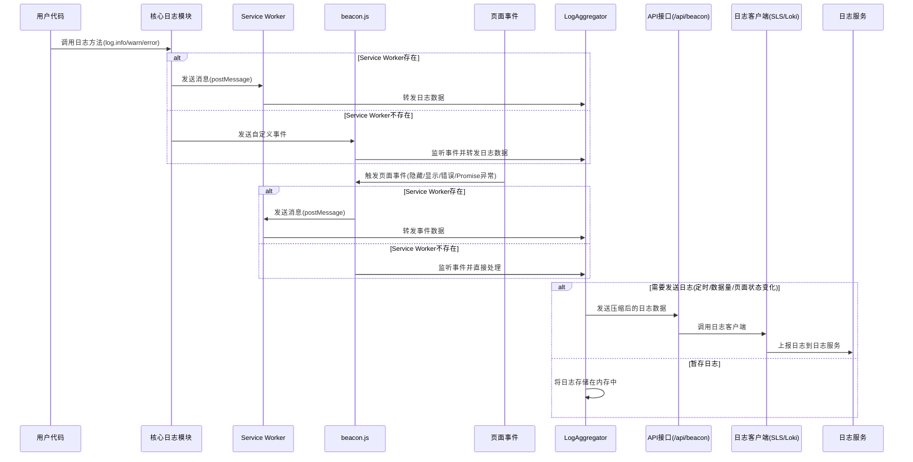

# Logs

浏览器端日志采集与上报工具，支持多种日志服务后端，包括阿里云日志服务(SLS)和 Grafana Loki。通过客户端和服务端的配合，实现日志的无缝采集和传输。

## 功能特性

- 💡 **多平台支持**：支持浏览器、Node.js 等多种 JavaScript 运行环境
- 🔄 **多种日志服务**：支持阿里云日志服务(SLS)和 Grafana Loki
- 📝 **智能的默认日志级别**：
    - **浏览器端**：默认为 `WARN` 级别，保持控制台清洁。
    - **服务端 (Node.js)**：默认为 `TRACE` 级别，确保捕获所有日志信息，方便开发调试及日志采集。可通过 `LOGS_LEVEL` 环境变量覆盖。
- 🔌 **可扩展性**：模块化设计，易于扩展支持其他日志服务
- 🚀 **高性能**：批量处理、压缩传输，减少网络开销
- 🔍 **过滤功能**：支持关键词过滤，减少无用日志
- 🧩 **Service Worker 支持**：通过 Service Worker 处理日志，减轻主线程负担
- 🔒 **代码保护**：使用代码压缩和混淆技术，保护日志库的安全性
- 🛠️ **开发辅助工具**：提供日志级别和关键字过滤控制面板，方便开发调试
- 🧠 **智能序列化**：能够安全处理各类复杂数据结构（如深度嵌套对象、循环引用），并对超长数组进行智能采样（保留头、中、尾关键元素），在保留关键信息的同时有效防止日志超长被截断。

## 安装

```bash
npm install logs
# 或
yarn add logs
```

## 使用方法

本库分为**浏览器端**和**服务端**两部分，需要配合使用才能完成日志的采集和上报。

### 浏览器端使用

浏览器端负责日志的记录、收集和发送到服务端接口。

#### 1. 基本日志记录与级别说明

**默认日志级别**:
- **浏览器端**: `logs` 在浏览器中默认使用 `WARN` 级别 (这是 `loglevel` 库本身的默认行为)。这意味着只有 `log.warn()` 和 `log.error()` 的日志会默认显示在控制台。
- **服务端 (Node.js)**: `logs` 在 Node.js 环境中默认使用 `TRACE` 级别。这意味着所有级别的日志 (`trace`, `debug`, `info`, `warn`, `error`) 都会被处理。此设置确保了在开发和生产环境中，默认情况下能捕获到最详细的日志，便于调试和第三方服务采集。

**修改日志级别**:
您可以在代码中随时通过 `log.setLevel()` 方法来修改当前的日志级别。此方法接受的参数为日志级别字符串 (如 `'trace'`, `'debug'`, `'info'`, `'warn'`, `'error'`, `'silent'`) 或对应的数字。

```javascript
import log from 'logs';

// 设置日志级别
log.setLevel('info');

// 记录不同级别的日志
log.trace('这是 trace 级别的日志');  // 不会被记录，因为级别低于 info
log.debug('这是 debug 级别的日志');  // 不会被记录，因为级别低于 info
log.info('这是 info 级别的日志');    // 会被记录
log.warn('这是 warn 级别的日志');    // 会被记录
log.error('这是 error 级别的日志');  // 会被记录

// 设置过滤关键词（简单的字符串前缀过滤）
log.setKeyWords('login');  // 仅显示以 'login' 开头的日志

/**
 * 关于 setKeyWords 的说明：
 * 
 * 1. 这是一个简单的日志过滤机制，仅检查日志的第一个参数
 * 2. 过滤条件：日志的第一个参数必须是字符串，且以设置的关键字开头
 * 3. 过滤设置保存在 localStorage 中，页面刷新后依然有效
 * 4. 限制：
 *    - 只能过滤第一个参数为字符串的日志
 *    - 只能按前缀匹配，不支持正则或其他复杂匹配
 *    - 不适用于第一个参数为对象、数组等非字符串类型的日志
 * 5. 开发环境中，建议使用提供的日志过滤控制面板来设置过滤条件
 */

// 记录带有上下文信息的日志
log.info('用户操作', {
  userId: '12345',
  action: 'click',
  component: 'button',
  timestamp: Date.now()
});
```

**服务端修改默认日志级别 (通过环境变量)**:
在 Node.js 环境中，您可以通过设置 `LOGS_LEVEL` 环境变量来覆盖模块加载时设置的默认 `TRACE` 级别。支持的级别同 `loglevel` 库（`trace`, `debug`, `info`, `warn`, `error`, `silent`）。

#### 2. 集成 Service Worker

要启用 Service Worker 处理日志，需要将相关文件复制到项目的公共目录，并在页面中引入 beacon.js 脚本：

**步骤 1**: 从git仓库的dist目录复制必要的文件到项目的公共目录

从git仓库的`dist`目录中，根据您使用的日志服务选择对应的子目录：
- `dist/loki` - 用于Grafana Loki日志服务
- `dist/sls` - 用于阿里云日志服务(SLS)

将选择的目录中的`beacon.js`和`beacon-sw.js`文件复制到您项目的公共目录下的`beacon`文件夹中（例如`public/beacon/`）。

> **重要提示**：
> - 两个文件**必须**都放在名为`beacon`的目录下
> - 文件名必须保持为`beacon.js`和`beacon-sw.js`
> - 不要修改这些文件的内容

**步骤 2**: 在页面中引入 beacon.js 脚本

```jsx
// 在 Next.js 的 layout.jsx 或其他布局文件中
export default function RootLayout({ children }) {
  return (
    <html lang="zh-CN">
      <body>
        {children}
        <script src="/beacon/beacon.js"></script>
      </body>
    </html>
  );
}
```

> **注意**: 不需要手动注册 Service Worker，beacon.js 会自动处理注册过程。Service Worker 会自动监听页面状态变化、错误事件和未处理的 Promise 异常。

### 服务端使用

服务端负责接收浏览器发送的日志数据，并将其转发到日志服务。

#### 1. 创建日志接收接口

需要创建一个 `/api/beacon` 接口来接收浏览器发送的日志数据。

#### 2. 阿里云日志服务 (SLS) 集成

```javascript
// src/app/api/beacon/route.ts (App Router) 或 pages/api/beacon.ts (Pages Router)
import { createLogClient } from 'logs/sls';

const slsClient = createLogClient(
  'ap-southeast-1.log.aliyuncs.com',  // 服务入口
  'YOUR_ACCESS_KEY_ID',               // 访问密钥ID
  'YOUR_ACCESS_KEY_SECRET',           // 访问密钥密码
  'YOUR_PROJECT_NAME',                // 项目名称
  'YOUR_LOGSTORE_NAME'                // 日志库名称
);

export async function POST(request) {
  const body = await request.arrayBuffer();
  await slsClient(new Uint8Array(body));
  return new Response(null, { status: 204 });
}
```

#### 3. Grafana Loki 集成

```javascript
// src/app/api/beacon/route.ts (App Router) 或 pages/api/beacon.ts (Pages Router)
import { createLogClient } from 'logs/loki';

const lokiClient = createLogClient(
  'https://logs-prod-xxx.grafana.net',  // Loki 服务地址
  'YOUR_USERNAME',                      // 用户名
  'YOUR_API_TOKEN'                      // API Token
);

export async function POST(request) {
  const body = await request.arrayBuffer();
  await lokiClient(new Uint8Array(body));
  return new Response(null, { status: 204 });
}
```

### Next.js 完整示例

#### 1. 服务端接口实现

```typescript
// src/app/api/beacon/route.ts
import { NextRequest } from 'next/server';
import { createLogClient } from 'logs/loki';

// 创建 Loki 日志客户端
const lokiClient = createLogClient(
  'https://logs-prod-xxx.grafana.net',
  'YOUR_USERNAME',
  'YOUR_API_TOKEN'
);

export async function POST(request: NextRequest) {
  try {
    // 获取请求体中的二进制数据
    const payload = await request.arrayBuffer();
    
    // 发送日志数据
    await lokiClient(new Uint8Array(payload));
    
    // 返回成功响应
    return new Response(null, { status: 204 });
  } catch (error) {
    console.error('日志处理失败:', error);
    return new Response('Error processing logs', { status: 500 });
  }
}
```

#### 2. 在页面中引入 beacon.js 脚本

```jsx
// src/app/layout.jsx 或其他布局文件
export default function RootLayout({ children }) {
  return (
    <html lang="zh-CN">
      <body>
        {children}
        <script src="/beacon/beacon.js"></script>
      </body>
    </html>
  );
}
```

#### 5. 使用日志记录组件

```tsx
// src/components/Logger.tsx
'use client';

import log from 'logs';
import { useEffect } from 'react';

export default function Logger() {
  useEffect(() => {
    // 设置日志级别
    log.setLevel('info');
    
    // 记录日志
    log.info('页面已加载', {
      page: window.location.pathname,
      timestamp: Date.now()
    });
    
    // 监听组件卸载
    return () => {
      log.info('页面已卸载');
    };
  }, []);
  
  return null; // 这是一个无UI组件
}
```

## 项目架构

### 模块结构

```
logs/
├── core/           # 核心日志模块
├── common/         # 公共工具和组件
│   ├── LogAggregator.js  # 日志聚合器
│   ├── utils.js          # 工具函数
│   └── serializeLogContent.js # 日志序列化
├── sls/            # 阿里云日志服务集成
│   ├── beacon.js   # 浏览器客户端（自动注册 Service Worker）
│   ├── beacon-sw.js # Service Worker 处理模块
│   └── slsClient.js # 服务端客户端
├── loki/           # Grafana Loki 集成
│   ├── beacon.js   # 浏览器客户端（自动注册 Service Worker）
│   ├── beacon-sw.js # Service Worker 处理模块
│   └── lokiClient.js # 服务端客户端
├── types/          # TypeScript 类型定义
└── eslint/         # ESLint 插件
    └── index.js    # 用于检测和转换 console 调用
```

### 客户端架构

客户端日志系统由三个主要部分组成：

1. **核心日志模块**：提供日志打印API和日志级别控制
2. **浏览器集成模块**：注册Service Worker并监听浏览器事件
3. **Service Worker模块**：接收、聚合和上报日志

### 日志上报策略

系统采用智能上报策略，在以下情况触发日志上报：

1. **定时上报**：默认每5分钟上报一次日志
2. **数据量触发**：当缓存的日志数据量超过预设阈值（默认3MB）时立即上报
3. **页面状态变化**：当页面隐藏或卸载时触发上报

## 数据流程



日志数据流程详解：

1. **用户代码打印日志**：
   - 用户代码调用日志方法（如 log.info/warn/error）
   - 核心日志模块接收日志请求

2. **核心模块处理**：
   - 核心模块检测 Service Worker 是否存在
   - 如果 Service Worker 存在，通过 postMessage 发送消息
   - 如果 Service Worker 不存在，发送自定义事件

3. **页面事件处理**：
   - beacon.js 监听页面隐藏/显示、错误事件和 unhandledrejection 事件
   - 事件触发时，beacon.js 同样检测 Service Worker 是否存在
   - 根据 Service Worker 状态选择发送消息或直接处理

4. **LogAggregator 处理**：
   - 所有日志和事件最终汇聚到 LogAggregator
   - LogAggregator 根据策略决定是暂存日志还是立即发送
   - 触发发送的条件包括：定时上报、数据量超限、页面状态变化

5. **日志上报**：
   - 当需要发送日志时，LogAggregator 将压缩后的日志数据发送到 /api/beacon 接口
   - API 接口调用相应的日志客户端(SLS或Loki)
   - 日志客户端将日志上报到日志服务
   - 最终通过日志服务的界面查看和分析日志

## 日志内容

系统会自动收集以下信息：

| 字段       | 作用                                                         |
| ---------- | ------------------------------------------------------------ |
| time       | 毫秒级时间戳，日志发生的时间（注：Loki编码器会将其转换为纳秒级时间戳）|
| level      | 日志级别；"trace"  "debug"  "info"  "warn"  "error"          |
| content    | 序列化之后的日志内容                                         |
| clientUuid | 客户端的唯一ID，存储在localStorage中                         |
| userAgent  | 浏览器的userAgent信息，使用UAParser进行解析                  |
| screen     | 用户的屏幕宽高                                               |
| window     | 用户的浏览器可视窗口宽高                                     |
| url        | 日志打印时的页面URL                                          |
| referrer   | 页面来源 URL (`document.referrer`)                             |
| ip         | 用户的公网IP（每天更新一次）                                 |
| region     | 用户的地理位置（国家/地区）                                  |

## ESLint 插件

本库提供了 ESLint 插件，可以帮助您将代码中的 `console.xxx` 调用自动替换为 `log.xxx`，保持日志记录的一致性。

### 使用方法

#### 1. 在 ESLint 配置中引入插件

```javascript
// .eslintrc.js
const logsTransformPlugin = require('logbeacon/eslint');

module.exports = {
  plugins: {
    'logs-transform': logsTransformPlugin
  },
  rules: {
    'logs-transform/prefer-log-over-console': 'warn' // 或 'error'
  }
};
```

#### 2. 配置选项

插件支持以下配置选项，所有配置项都是**可选的**：

```javascript
// .eslintrc.js
module.exports = {
  // ...
  rules: {
    'logs-transform/prefer-log-over-console': ['warn', {
      // 以下所有配置项都是可选的，如果不提供将使用默认值
      importSource: 'logbeacon',  // 导入源，默认为 'logbeacon'
      importName: 'log',          // 导入名称，默认为 'log'
      methodMap: {                // 方法映射，可自定义 console 方法到 log 方法的映射
        log: 'debug',            // console.log 映射到 log.debug
        debug: 'debug',          // console.debug 映射到 log.debug
        info: 'info',            // console.info 映射到 log.info
        warn: 'warn',            // console.warn 映射到 log.warn
        error: 'error',          // console.error 映射到 log.error
        trace: 'trace'           // console.trace 映射到 log.trace
      }
    }]
  }
};
```

**默认配置**

如果不提供任何配置项，插件将使用以下默认值：

```javascript
// 默认配置
{
  importSource: 'logbeacon',
  importName: 'log',
  methodMap: {
    log: 'debug',
    debug: 'debug',
    info: 'info',
    warn: 'warn',
    error: 'error',
    trace: 'trace'
  }
}
```

#### 3. 自动修复

插件支持自动修复功能，可以通过 `eslint --fix` 命令自动将代码中的 `console.xxx` 调用替换为 `log.xxx`，并自动添加必要的导入语句。

```bash
npx eslint --fix src/
```

#### 4. 插件功能

- 自动检测 `console.log`、`console.info`、`console.debug`、`console.warn`、`console.error` 和 `console.trace` 调用
- 根据配置的映射规则替换为对应的 `log` 方法
- 自动添加必要的导入语句
- 支持 ESM 和 CommonJS 两种模块系统
- 支持检测和替换解构赋值的 console 方法（如 `const { log } = console`）

## 开发辅助工具

为了方便开发调试，我们提供了一个日志过滤工具，可以在开发环境中使用：

### 使用方法

#### 1. 复制文件

从 `dist/dev-tools` 目录中复制 `log-filter.js` 到您项目的公共目录下的 `beacon` 文件夹中（与 `beacon.js` 和 `beacon-sw.js` 放在同一目录）。

```
项目目录
└── public/
    └── beacon/
        ├── beacon.js         # 从 dist/sls 或 dist/loki 复制
        ├── beacon-sw.js      # 从 dist/sls 或 dist/loki 复制
        └── log-filter.js     # 从 dist/dev-tools 复制
```

#### 2. 在页面中引入脚本

```html
<!-- 仅在开发环境中引入 -->
<script src="/beacon/log-filter.js"></script>
```

或者在 Next.js 等框架中，您可以有条件地引入：

```jsx
// 在 Next.js 的 layout.jsx 或其他布局文件中
export default function RootLayout({ children }) {
  const isDev = process.env.NODE_ENV === 'development';
  
  return (
    <html lang="zh-CN">
      <body>
        {children}
        <script src="/beacon/beacon.js"></script>
        {isDev && <script src="/beacon/log-filter.js"></script>}
      </body>
    </html>
  );
}
```

#### 3. 功能说明

该工具提供了一个浮动控制面板，允许您在运行时：

- **调整日志级别**：选择 trace、debug、info、warn、error 或 silent 级别
- **设置关键字过滤**：输入关键字，日志如果以关键字开头则显示，否则不显示
- **清除过滤设置**：一键清除当前的过滤关键字

所有设置都会保存在浏览器的 localStorage 中，刷新页面后依然有效。

##### 关键字过滤机制说明

关键字过滤是一个简单实用的开发辅助功能，它的工作原理如下：

1. **过滤机制**：只检查日志的第一个参数，如果是字符串且以设置的关键字开头，则显示该日志
2. **存储方式**：关键字设置保存在 localStorage 的 `_logFilterKeyWords` 键中
3. **使用场景**：当您需要关注特定模块或功能的日志时，可以为这些日志添加统一前缀，然后设置该前缀作为过滤关键字

**限制**：

- 只能过滤第一个参数为字符串的日志
- 只能按前缀匹配，不支持正则或其他复杂匹配
- 不适用于第一个参数为对象、数组等非字符串类型的日志

**最佳实践**：

为了更好地利用这一功能，建议在代码中为相关模块的日志添加统一前缀，例如：

```javascript
// 用户模块日志
 log.info('user: 用户登录成功', { userId: '12345' });

// 支付模块日志
 log.info('payment: 支付请求发送', { orderId: '67890' });
```

这样在开发调试时，可以通过设置关键字为 `user:` 或 `payment:` 来只显示特定模块的日志。

> **注意**：该工具仅在开发环境（localhost 或 127.0.0.1）中显示控制面板，生产环境中不会显示。

## 许可证

MIT
