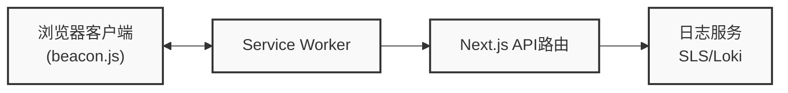

# Logs

浏览器端日志采集与上报工具，支持多种日志服务后端，包括阿里云日志服务(SLS)和 Grafana Loki。通过客户端和服务端的配合，实现日志的无缝采集和传输。

## 功能特性

- 💡 **多平台支持**：支持浏览器、Node.js 等多种 JavaScript 运行环境
- 🔄 **多种日志服务**：支持阿里云日志服务(SLS)和 Grafana Loki
- 🔌 **可扩展性**：模块化设计，易于扩展支持其他日志服务
- 🚀 **高性能**：批量处理、压缩传输，减少网络开销
- 🛡️ **可靠性**：离线缓存、重试机制，确保日志不丢失
- 🔍 **过滤功能**：支持关键词过滤，减少无用日志
- 🧩 **Service Worker 支持**：通过 Service Worker 处理日志，减轻主线程负担
- 🔒 **代码保护**：使用代码压缩和混淆技术，保护日志库的安全性

## 安装

```bash
npm install logs
# 或
yarn add logs
```

## 使用方法

本库分为**浏览器端**和**服务端**两部分，需要配合使用才能完成日志的采集和上报。

### 浏览器端使用

浏览器端负责日志的记录、收集和发送到服务端接口。

#### 1. 基本日志记录

```javascript
import log from 'logs';

// 设置日志级别
log.setLevel('info');

// 记录不同级别的日志
log.trace('这是 trace 级别的日志');  // 不会被记录，因为级别低于 info
log.debug('这是 debug 级别的日志');  // 不会被记录，因为级别低于 info
log.info('这是 info 级别的日志');    // 会被记录
log.warn('这是 warn 级别的日志');    // 会被记录
log.error('这是 error 级别的日志');  // 会被记录

// 设置过滤关键词
log.setKeyWords('ignore');  // 过滤掉以 'ignore' 开头的日志

// 记录带有上下文信息的日志
log.info('用户操作', {
  userId: '12345',
  action: 'click',
  component: 'button',
  timestamp: Date.now()
});
```

#### 2. 集成 Service Worker

要启用 Service Worker 处理日志，需要将相关文件复制到项目的公共目录，并在页面中引入 beacon.js 脚本：

**步骤 1**: 复制必要的文件到公共目录

```javascript
// 在构建脚本中添加（例如 Next.js 的 next.config.js 或自定义脚本）
const fs = require('fs');
const path = require('path');

// 选择使用 SLS 或 Loki
const sourceDir = path.resolve(__dirname, 'node_modules/logs/dist/loki');
// 或 const sourceDir = path.resolve(__dirname, 'node_modules/logs/dist/sls');
const targetDir = path.resolve(__dirname, 'public/beacon');

// 确保目标目录存在
if (!fs.existsSync(targetDir)) {
  fs.mkdirSync(targetDir, { recursive: true });
}

// 复制文件
fs.copyFileSync(
  path.join(sourceDir, 'beacon-sw.js'),
  path.join(targetDir, 'beacon-sw.js')
);
fs.copyFileSync(
  path.join(sourceDir, 'beacon.js'),
  path.join(targetDir, 'beacon.js')
);
```

**步骤 2**: 在页面中引入 beacon.js 脚本

```jsx
// 在 Next.js 的 layout.jsx 或其他布局文件中
export default function RootLayout({ children }) {
  return (
    <html lang="zh-CN">
      <body>
        {children}
        <script src="/beacon/beacon.js"></script>
      </body>
    </html>
  );
}
```

> **注意**: 不需要手动注册 Service Worker，beacon.js 会自动处理注册过程。Service Worker 会自动监听页面状态变化、错误事件和未处理的 Promise 异常。

### 服务端使用

服务端负责接收浏览器发送的日志数据，并将其转发到日志服务。

#### 1. 创建日志接收接口

需要创建一个 `/api/beacon` 接口来接收浏览器发送的日志数据。

#### 2. 阿里云日志服务 (SLS) 集成

```javascript
// src/app/api/beacon/route.ts (App Router) 或 pages/api/beacon.ts (Pages Router)
import { createLogClient } from 'logs/sls';

const slsClient = createLogClient(
  'ap-southeast-1.log.aliyuncs.com',  // 服务入口
  'YOUR_ACCESS_KEY_ID',               // 访问密钥ID
  'YOUR_ACCESS_KEY_SECRET',           // 访问密钥密码
  'YOUR_PROJECT_NAME',                // 项目名称
  'YOUR_LOGSTORE_NAME'                // 日志库名称
);

export async function POST(request) {
  const body = await request.arrayBuffer();
  await slsClient(new Uint8Array(body));
  return new Response(null, { status: 204 });
}
```

#### 3. Grafana Loki 集成

```javascript
// src/app/api/beacon/route.ts (App Router) 或 pages/api/beacon.ts (Pages Router)
import { createLogClient } from 'logs/loki';

const lokiClient = createLogClient(
  'https://logs-prod-xxx.grafana.net',  // Loki 服务地址
  'YOUR_USERNAME',                      // 用户名
  'YOUR_API_TOKEN'                      // API Token
);

export async function POST(request) {
  const body = await request.arrayBuffer();
  await lokiClient(new Uint8Array(body));
  return new Response(null, { status: 204 });
}
```

### Next.js 完整示例

#### 1. 服务端接口实现

```typescript
// src/app/api/beacon/route.ts
import { NextRequest } from 'next/server';
import { createLogClient } from 'logs/loki';

// 创建 Loki 日志客户端
const lokiClient = createLogClient(
  'https://logs-prod-xxx.grafana.net',
  'YOUR_USERNAME',
  'YOUR_API_TOKEN'
);

export async function POST(request: NextRequest) {
  try {
    // 获取请求体中的二进制数据
    const payload = await request.arrayBuffer();
    
    // 发送日志数据
    await lokiClient(new Uint8Array(payload));
    
    // 返回成功响应
    return new Response(null, { status: 204 });
  } catch (error) {
    console.error('日志处理失败:', error);
    return new Response('Error processing logs', { status: 500 });
  }
}
```

#### 2. 配置文件复制脚本

```javascript
// scripts/copy-sw.js
const fs = require('fs');
const path = require('path');

// 源文件路径 - 选择使用 Loki 或 SLS
const sourceDir = path.resolve(__dirname, '../node_modules/logs/dist/loki');
// 或 const sourceDir = path.resolve(__dirname, '../node_modules/logs/dist/sls');
const targetDir = path.resolve(__dirname, '../public/beacon');

// 确保目标目录存在
if (!fs.existsSync(targetDir)) {
  fs.mkdirSync(targetDir, { recursive: true });
}

// 复制文件
fs.copyFileSync(
  path.join(sourceDir, 'beacon-sw.js'),
  path.join(targetDir, 'beacon-sw.js')
);
fs.copyFileSync(
  path.join(sourceDir, 'beacon.js'),
  path.join(targetDir, 'beacon.js')
);

console.log('Service Worker 文件已复制到 public/beacon 目录');
```

#### 3. 在 package.json 中添加构建前脚本

```json
{
  "scripts": {
    "prebuild": "node scripts/copy-sw.js",
    "predev": "node scripts/copy-sw.js"
  }
}
```

#### 4. 在页面中引入 beacon.js 脚本

```jsx
// src/app/layout.jsx 或其他布局文件
export default function RootLayout({ children }) {
  return (
    <html lang="zh-CN">
      <body>
        {children}
        <script src="/beacon/beacon.js"></script>
      </body>
    </html>
  );
}
```

#### 5. 使用日志记录组件

```tsx
// src/components/Logger.tsx
'use client';

import log from 'logs';
import { useEffect } from 'react';

export default function Logger() {
  useEffect(() => {
    // 设置日志级别
    log.setLevel('info');
    
    // 记录日志
    log.info('页面已加载', {
      page: window.location.pathname,
      timestamp: Date.now()
    });
    
    // 监听组件卸载
    return () => {
      log.info('页面已卸载');
    };
  }, []);
  
  return null; // 这是一个无UI组件
}
```

## 项目架构

### 模块结构

```
logs/
├── core/           # 核心日志模块
├── common/         # 公共工具和组件
│   ├── LogAggregator.js  # 日志聚合器
│   ├── utils.js          # 工具函数
│   └── serializeLogContent.js # 日志序列化
├── sls/            # 阿里云日志服务集成
│   ├── beacon.js   # 浏览器客户端（自动注册 Service Worker）
│   ├── beacon-sw.js # Service Worker 处理模块
│   └── slsClient.js # 服务端客户端
├── loki/           # Grafana Loki 集成
│   ├── beacon.js   # 浏览器客户端（自动注册 Service Worker）
│   ├── beacon-sw.js # Service Worker 处理模块
│   └── lokiClient.js # 服务端客户端
└── types/          # TypeScript 类型定义
```

### 客户端架构

客户端日志系统由三个主要部分组成：

1. **核心日志模块**：提供日志打印API和日志级别控制
2. **浏览器集成模块**：注册Service Worker并监听浏览器事件
3. **Service Worker模块**：接收、聚合和上报日志

### 日志上报策略

系统采用智能上报策略，在以下情况触发日志上报：

1. **定时上报**：默认每5分钟上报一次日志
2. **数据量触发**：当缓存的日志数据量超过预设阈值（默认3MB）时立即上报
3. **页面状态变化**：当页面隐藏或卸载时触发上报

## 数据流程



1. 浏览器客户端通过logs库打印日志，logs库将日志发送给Service Worker
2. Service Worker聚合日志并根据策略决定何时上报
3. 上报时，Service Worker将压缩后的日志发送到Next.js API路由
4. API路由使用相应的客户端（SLS或Loki）将日志发送到日志服务
5. 最终通过Grafana或阿里云控制台查看和分析日志

## 日志内容

系统会自动收集以下信息：

| 字段       | 作用                                                         |
| ---------- | ------------------------------------------------------------ |
| time       | 毫秒级时间戳，日志发生的时间（注：Loki编码器会将其转换为纳秒级时间戳）|
| level      | 日志级别；"trace"  "debug"  "info"  "warn"  "error"          |
| content    | 序列化之后的日志内容                                         |
| clientUuid | 客户端的唯一ID，存储在localStorage中                         |
| userAgent  | 浏览器的userAgent信息，使用UAParser进行解析                  |
| screen     | 用户的屏幕宽高                                               |
| window     | 用户的浏览器可视窗口宽高                                     |
| url        | 日志打印时的页面URL                                          |
| ip         | 用户的公网IP（每天更新一次）                                 |
| region     | 用户的地理位置（国家/地区）                                  |

## 许可证

MIT
